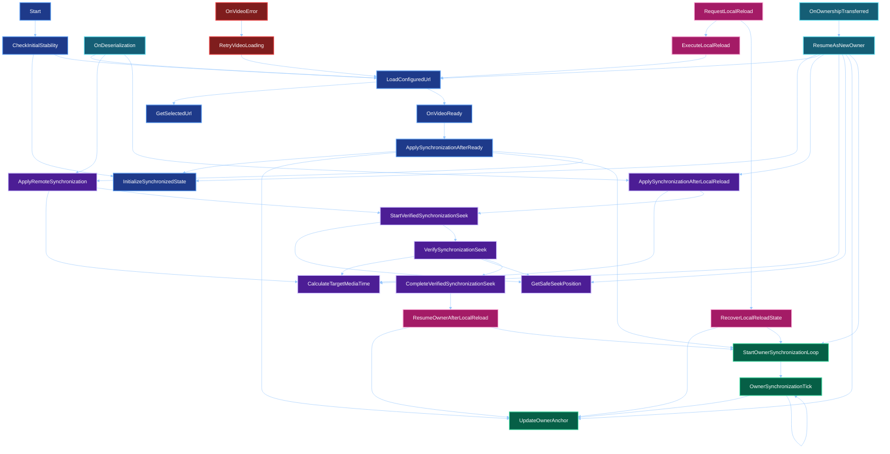

# HLS同期プレイヤー　メソッドの対応

```mermaid
%%{
	init:
	{
		"theme": "dark",
		"themeVariables":
		{
			"primaryColor":"#0b1220",
			"primaryTextColor":"#e5e7eb",
			"primaryBorderColor":"#60a5fa",
			"lineColor":"#93c5fd",
			"secondaryColor":"#111827",
			"tertiaryColor":"#0f172a",
			"fontFamily":"\"Hiragino Kaku Gothic ProN\", \"YuGothic\", \"Yu Gothic\", sans-serif"
		}
	}
}%%
flowchart TB
	A["Start"] --> B["CheckInitialStability"]
	B --> C["InitializeSynchronizedState"]
	B --> D["LoadConfiguredUrl"]
	D --> E["GetSelectedUrl"]
	D --> F["OnVideoReady"]
	F --> G["ApplySynchronizationAfterReady"]
	G --> C
	G --> H["UpdateOwnerAnchor"]
	G --> I["StartOwnerSynchronizationLoop"]
	G --> J["ApplyRemoteSynchronization"]
	J --> K["CalculateTargetMediaTime"]
	J --> L["StartVerifiedSynchronizationSeek"]
	L --> M["GetSafeSeekPosition"]
	L --> N["VerifySynchronizationSeek"]
	N --> K
	N --> M
	N --> O["CompleteVerifiedSynchronizationSeek"]
	I --> P["OwnerSynchronizationTick"]
	P --> H
	P --> P
	Q["OnDeserialization"] --> D
	Q --> J
	Q --> R["ApplySynchronizationAfterLocalReload"]
	R --> K
	R --> L
	S["OnOwnershipTransferred"] --> T["ResumeAsNewOwner"]
	T --> C
	T --> D
	T --> R
	T --> K
	T --> M
	T --> H
	T --> I
	U["RequestLocalReload"] --> V["ExecuteLocalReload"]
	U --> W["RecoverLocalReloadState"]
	V --> D
	W --> H
	W --> I
	O --> X["ResumeOwnerAfterLocalReload"]
	X --> H
	X --> I
	Y["OnVideoError"] --> Z["RetryVideoLoading"]
	Z --> D

	classDef subgraph_box_blue fill:#1f2937,stroke:#64748b,color:#e5e7eb;
	classDef subgraph_box_green fill:#0f1f1a,stroke:#7a8f86,color:#e5e7eb;
	classDef subgraph_box_red fill:#2a1222,stroke:#9b7a8c,color:#e5e7eb;
	classDef blue fill:#1e3a8a,stroke:#60a5fa,color:#ffffff,stroke-width:2px;
	classDef green fill:#065f46,stroke:#34d399,color:#ffffff,stroke-width:2px;
	classDef yellow fill:#8a6a00,stroke:#fde68a,color:#ffffff,stroke-width:2px;
	classDef red fill:#7f1d1d,stroke:#ef4444,color:#ffffff,stroke-width:2px;
	classDef purple fill:#4c1d95,stroke:#c4b5fd,color:#ffffff,stroke-width:2px;
	classDef cyan fill:#155e75,stroke:#67e8f9,color:#ffffff,stroke-width:2px;
	classDef pink fill:#a41b66,stroke:#f9a8d4,color:#ffffff,stroke-width:2px;

	class A,B,C,D,E,F,G blue;
	class H,I,P green;
	class J,K,L,M,N,O,R purple;
	class Q,S,T cyan;
	class U,V,W,X pink;
	class Y,Z red;
```
