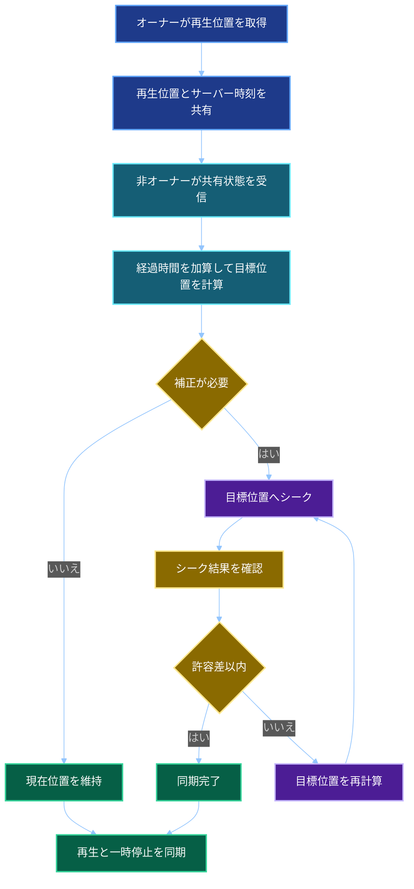
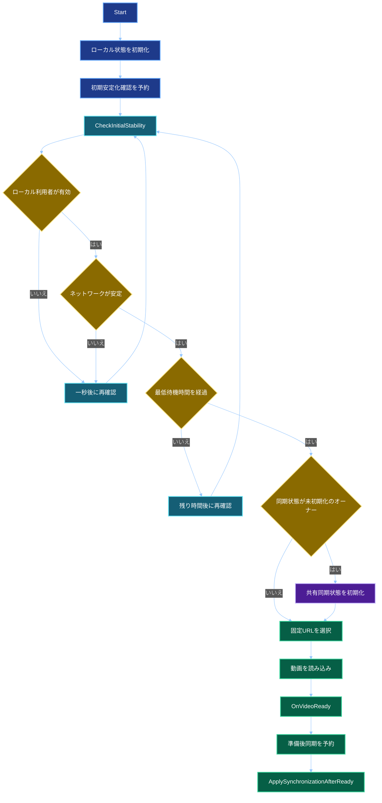
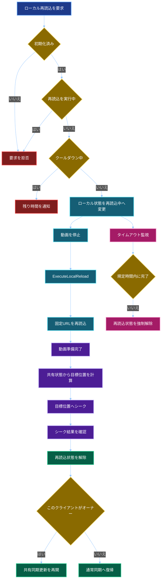
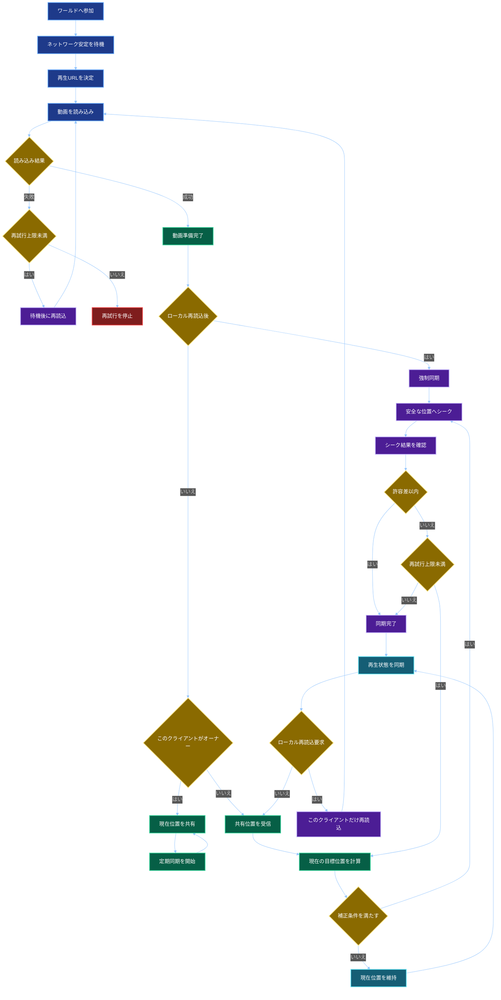

# HLS同期プレイヤー　処理の流れ

## 概要

```mermaid
%%{
	init:
	{
		"theme": "dark",
		"themeVariables":
		{
			"primaryColor":"#0b1220",
			"primaryTextColor":"#e5e7eb",
			"primaryBorderColor":"#60a5fa",
			"lineColor":"#93c5fd",
			"secondaryColor":"#111827",
			"tertiaryColor":"#0f172a",
			"fontFamily":"\"Hiragino Kaku Gothic ProN\", \"YuGothic\", \"Yu Gothic\", sans-serif"
		}
	}
}%%
flowchart TB
	A["オーナーが再生位置を取得"] --> B["再生位置とサーバー時刻を共有"]
	B --> C["非オーナーが共有状態を受信"]
	C --> D["経過時間を加算して目標位置を計算"]
	D --> E{"補正が必要"}
	E -- "はい" --> F["目標位置へシーク"]
	E -- "いいえ" --> G["現在位置を維持"]
	F --> H["シーク結果を確認"]
	H --> I{"許容差以内"}
	I -- "はい" --> J["同期完了"]
	I -- "いいえ" --> K["目標位置を再計算"]
	K --> F
	G --> L["再生と一時停止を同期"]
	J --> L

	classDef subgraph_box_blue fill:#1f2937,stroke:#64748b,color:#e5e7eb;
	classDef subgraph_box_green fill:#0f1f1a,stroke:#7a8f86,color:#e5e7eb;
	classDef subgraph_box_red fill:#2a1222,stroke:#9b7a8c,color:#e5e7eb;
	classDef blue fill:#1e3a8a,stroke:#60a5fa,color:#ffffff,stroke-width:2px;
	classDef green fill:#065f46,stroke:#34d399,color:#ffffff,stroke-width:2px;
	classDef yellow fill:#8a6a00,stroke:#fde68a,color:#ffffff,stroke-width:2px;
	classDef red fill:#7f1d1d,stroke:#ef4444,color:#ffffff,stroke-width:2px;
	classDef purple fill:#4c1d95,stroke:#c4b5fd,color:#ffffff,stroke-width:2px;
	classDef cyan fill:#155e75,stroke:#67e8f9,color:#ffffff,stroke-width:2px;
	classDef pink fill:#a41b66,stroke:#f9a8d4,color:#ffffff,stroke-width:2px;

	class A,B blue;
	class C,D cyan;
	class E,H,I yellow;
	class F,K purple;
	class G,J,L green;
```

## 初期同期までの流れ

```mermaid
%%{
	init:
	{
		"theme": "dark",
		"themeVariables":
		{
			"primaryColor":"#0b1220",
			"primaryTextColor":"#e5e7eb",
			"primaryBorderColor":"#60a5fa",
			"lineColor":"#93c5fd",
			"secondaryColor":"#111827",
			"tertiaryColor":"#0f172a",
			"fontFamily":"\"Hiragino Kaku Gothic ProN\", \"YuGothic\", \"Yu Gothic\", sans-serif"
		}
	}
}%%
flowchart TB
	A["Start"] --> B["ローカル状態を初期化"]
	B --> C["初期安定化確認を予約"]
	C --> D["CheckInitialStability"]
	D --> E{"ローカル利用者が有効"}
	E -- "いいえ" --> F["一秒後に再確認"]
	F --> D
	E -- "はい" --> G{"ネットワークが安定"}
	G -- "いいえ" --> F
	G -- "はい" --> H{"最低待機時間を経過"}
	H -- "いいえ" --> I["残り時間後に再確認"]
	I --> D
	H -- "はい" --> J{"同期状態が未初期化のオーナー"}
	J -- "はい" --> K["共有同期状態を初期化"]
	J -- "いいえ" --> L["固定URLを選択"]
	K --> L
	L --> M["動画を読み込み"]
	M --> N["OnVideoReady"]
	N --> O["準備後同期を予約"]
	O --> P["ApplySynchronizationAfterReady"]

	classDef subgraph_box_blue fill:#1f2937,stroke:#64748b,color:#e5e7eb;
	classDef subgraph_box_green fill:#0f1f1a,stroke:#7a8f86,color:#e5e7eb;
	classDef subgraph_box_red fill:#2a1222,stroke:#9b7a8c,color:#e5e7eb;
	classDef blue fill:#1e3a8a,stroke:#60a5fa,color:#ffffff,stroke-width:2px;
	classDef green fill:#065f46,stroke:#34d399,color:#ffffff,stroke-width:2px;
	classDef yellow fill:#8a6a00,stroke:#fde68a,color:#ffffff,stroke-width:2px;
	classDef red fill:#7f1d1d,stroke:#ef4444,color:#ffffff,stroke-width:2px;
	classDef purple fill:#4c1d95,stroke:#c4b5fd,color:#ffffff,stroke-width:2px;
	classDef cyan fill:#155e75,stroke:#67e8f9,color:#ffffff,stroke-width:2px;
	classDef pink fill:#a41b66,stroke:#f9a8d4,color:#ffffff,stroke-width:2px;

	class A,B,C blue;
	class D,F,I cyan;
	class E,G,H,J yellow;
	class K purple;
	class L,M,N,O,P green;
```

## リロード土管

```mermaid
%%{
	init:
	{
		"theme": "dark",
		"themeVariables":
		{
			"primaryColor":"#0b1220",
			"primaryTextColor":"#e5e7eb",
			"primaryBorderColor":"#60a5fa",
			"lineColor":"#93c5fd",
			"secondaryColor":"#111827",
			"tertiaryColor":"#0f172a",
			"fontFamily":"\"Hiragino Kaku Gothic ProN\", \"YuGothic\", \"Yu Gothic\", sans-serif"
		}
	}
}%%
flowchart TB
	A["ローカル再読込を要求"] --> B{"初期化済み"}
	B -- "いいえ" --> C["要求を拒否"]
	B -- "はい" --> D{"再読込を実行中"}
	D -- "はい" --> C
	D -- "いいえ" --> E{"クールダウン中"}
	E -- "はい" --> F["残り時間を通知"]
	E -- "いいえ" --> G["ローカル状態を再読込中へ変更"]
	G --> H["動画を停止"]
	H --> I["ExecuteLocalReload"]
	I --> J["固定URLを再読込"]
	J --> K["動画準備完了"]
	K --> L["共有状態から目標位置を計算"]
	L --> M["目標位置へシーク"]
	M --> N["シーク結果を確認"]
	N --> O["再読込状態を解除"]
	O --> P{"このクライアントがオーナー"}
	P -- "はい" --> Q["共有同期更新を再開"]
	P -- "いいえ" --> R["通常同期へ復帰"]
	G --> S["タイムアウト監視"]
	S --> T{"規定時間内に完了"}
	T -- "いいえ" --> U["再読込状態を強制解除"]

	classDef subgraph_box_blue fill:#1f2937,stroke:#64748b,color:#e5e7eb;
	classDef subgraph_box_green fill:#0f1f1a,stroke:#7a8f86,color:#e5e7eb;
	classDef subgraph_box_red fill:#2a1222,stroke:#9b7a8c,color:#e5e7eb;
	classDef blue fill:#1e3a8a,stroke:#60a5fa,color:#ffffff,stroke-width:2px;
	classDef green fill:#065f46,stroke:#34d399,color:#ffffff,stroke-width:2px;
	classDef yellow fill:#8a6a00,stroke:#fde68a,color:#ffffff,stroke-width:2px;
	classDef red fill:#7f1d1d,stroke:#ef4444,color:#ffffff,stroke-width:2px;
	classDef purple fill:#4c1d95,stroke:#c4b5fd,color:#ffffff,stroke-width:2px;
	classDef cyan fill:#155e75,stroke:#67e8f9,color:#ffffff,stroke-width:2px;
	classDef pink fill:#a41b66,stroke:#f9a8d4,color:#ffffff,stroke-width:2px;

	class A blue;
	class B,D,E,P,T yellow;
	class C,F red;
	class G,H,I,J cyan;
	class K,L,M,N purple;
	class O,Q,R green;
	class S,U pink;
```

## 全体フロー

```mermaid
%%{
	init:
	{
		"theme": "dark",
		"themeVariables":
		{
			"primaryColor":"#0b1220",
			"primaryTextColor":"#e5e7eb",
			"primaryBorderColor":"#60a5fa",
			"lineColor":"#93c5fd",
			"secondaryColor":"#111827",
			"tertiaryColor":"#0f172a",
			"fontFamily":"\"Hiragino Kaku Gothic ProN\", \"YuGothic\", \"Yu Gothic\", sans-serif"
		}
	}
}%%
flowchart TB
	A["ワールドへ参加"] --> B["ネットワーク安定を待機"]
	B --> C["再生URLを決定"]
	C --> D["動画を読み込み"]
	D --> E{"読み込み結果"}
	E -- "成功" --> F["動画準備完了"]
	E -- "失敗" --> G{"再試行上限未満"}
	G -- "はい" --> H["待機後に再読込"]
	H --> D
	G -- "いいえ" --> I["再試行を停止"]
	F --> J{"ローカル再読込後"}
	J -- "はい" --> K["強制同期"]
	J -- "いいえ" --> L{"このクライアントがオーナー"}
	L -- "はい" --> M["現在位置を共有"]
	L -- "いいえ" --> N["共有位置を受信"]
	M --> O["定期同期を開始"]
	O --> M
	N --> P["現在の目標位置を計算"]
	P --> Q{"補正条件を満たす"}
	Q -- "はい" --> R["安全な位置へシーク"]
	Q -- "いいえ" --> S["現在位置を維持"]
	K --> R
	R --> T["シーク結果を確認"]
	T --> U{"許容差以内"}
	U -- "はい" --> V["同期完了"]
	U -- "いいえ" --> W{"再試行上限未満"}
	W -- "はい" --> P
	W -- "いいえ" --> V
	S --> X["再生状態を同期"]
	V --> X
	X --> Y{"ローカル再読込要求"}
	Y -- "はい" --> Z["このクライアントだけ再読込"]
	Z --> D
	Y -- "いいえ" --> N

	classDef subgraph_box_blue fill:#1f2937,stroke:#64748b,color:#e5e7eb;
	classDef subgraph_box_green fill:#0f1f1a,stroke:#7a8f86,color:#e5e7eb;
	classDef subgraph_box_red fill:#2a1222,stroke:#9b7a8c,color:#e5e7eb;
	classDef blue fill:#1e3a8a,stroke:#60a5fa,color:#ffffff,stroke-width:2px;
	classDef green fill:#065f46,stroke:#34d399,color:#ffffff,stroke-width:2px;
	classDef yellow fill:#8a6a00,stroke:#fde68a,color:#ffffff,stroke-width:2px;
	classDef red fill:#7f1d1d,stroke:#ef4444,color:#ffffff,stroke-width:2px;
	classDef purple fill:#4c1d95,stroke:#c4b5fd,color:#ffffff,stroke-width:2px;
	classDef cyan fill:#155e75,stroke:#67e8f9,color:#ffffff,stroke-width:2px;
	classDef pink fill:#a41b66,stroke:#f9a8d4,color:#ffffff,stroke-width:2px;

	class A,B,C,D blue;
	class E,G,J,L,Q,U,W,Y yellow;
	class F,M,N,O,P green;
	class H,K,R,T,V,Z purple;
	class S,X cyan;
	class I red;
```
